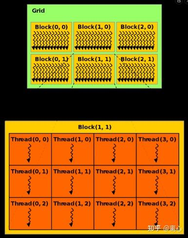
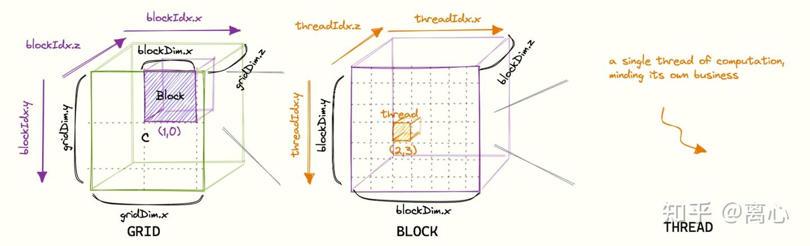
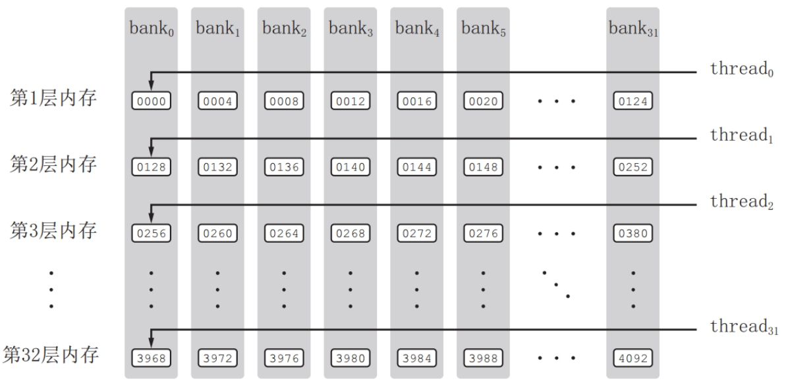
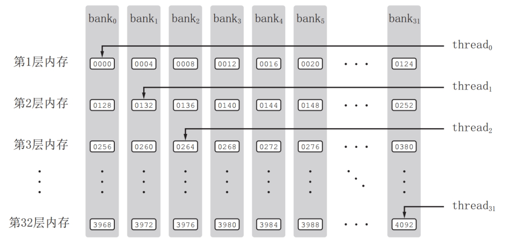

# CUDA Programming

## 基础
CUDA 程序一般使用 .cu 后缀，编译 CUDA 程序则使用 nvcc 编译器。  

cu 代码中有如下特殊前缀修饰符：  
- `__global__` 用来定义一个核函数（kernel function），在 CUDA 中，核函数只能返回 void 类型，这意味着当我们需要写计算结果时，应该在参数列表中传入一个用来存放计算结果的指针，然后将计算结果写回到这个指针指向的存储空间中。
- `__divice__` 修饰的函数称为设备（一般指GPU设备）函数，只能被核函数或是其它设备函数调用，只能在设备中执行
- `__host__` 修饰的函数称为主机函数，它就是主机端的普通 C++ 函数，在主机（CPU）中调用和执行，可以忽略

程序结构示例：
```cpp
__global__ void kernel1(data1,data2,...,result) {/**/}

__global__ void kernel2(data1,data2,...,result) {/**/}

int main() {
    //主机代码;
    dim3 grid_size(2,3); // 2-dim
    dim3 block_size(2,3); // 2-dim

    dim3 grid_size(3,3,3); // 3-dim
    dim3 block_size(3,3,3); // 3-dim
    void *result;
    //核函数1调用;
    kernel1<<<grid_size, block_size>>>(data1,data2,...,result);
    //主机代码;
    //核函数2调用;
    kernel2<<<grid_size, block_size>>>(data1,data2,...,result);
    //......
    return 0;  
}
```

### CUDA模型
上述示例代码定义的`grid_size`与`block_size`是本次调用核函数进行计算所分配的网格内线程块数量(`grid_size`)与线程块内线程数量(`block_size`)。你可以定义2维也可以定义3维的。

<!-- 当定义成2维时，可以将 grid 与 block 想象如下：  
 -->

定义成3维时，可以想象如下：  


1. cu代码有内置的全局变量，用于表示模型的大小与索引：
    - gridDim: `dim3`类型的结构体，包含 x, y, z 三个变量，这个变量对应调用核函数时的`dim3 grid_size(x,y,z)`。若`dim3 grid_size(3,2,4)`，则代表`gridDim.x=3`,`gridDim.y=2`,`gridDim.z=4`
    - blockDim: `dim3`类型的结构体，包含 x, y, z 三个变量，这个变量对应调用核函数时的`dim3 block_size(x,y,z)`。若`dim3 block_size(3,2,4)`，则代表`blockDim.x=3`,`blockDim.y=2`,`blockDim.z=4`
    - blockIdx: 指明线程块（block）在网格（grid）中的位置，其中：
        - blockIdx.x 的范围为 0 到 gridDim.x-1
        - blockIdx.y 的范围为 0 到 gridDim.y-1
        - blockIdx.z 的范围为 0 到 gridDim.z-1
    - threadIdx: 指明线程（thread）所线程块（block）中的位置，其中：
        - threadIdx.x 的范围为 0 到 blockDim.x-1
        - threadIdx.y 的范围为 0 到 blockDim.y-1
        - threadIdx.z 的范围为 0 到 blockDim.z-1
    > 不论是在 blockIdx 还是 threadIdx 中，x 都是变化最快的分量，其次是 y

实际核函数的设计一般就用`blockIdx`，`blockDim`与`threadIdx`获取线程的索引：
```cpp
__global__ void elementwise_add_f32_kernel(float* a, float* b, float* c, int N) {
  // 块索引*块维度大小+线程索引=线程全局索引
  int idx = blockIdx.x * blockDim.x + threadIdx.x;
  /**
   * 这个 if 语句的作用在于防止出现数组越界，这是一种非常惯用的处理方法：我们通常在确定 gridDim 和 blockDim 的大小时，会让实际执行的线程总数大于需要处理的数据数量（比如在数组加和的例子，数据数量就是数组长度 N），这样，一些线程实际上并不做任何计算，因为所有数据都已经被分配给其它线程处理。
  */
  if (idx < N) c[idx] = a[idx] + b[idx];
}
```

2. `grid_size`与`block_size`设置推荐
由下面两个缘由：
- 现代 NVIDIA GPU 架构（如Volta/Turing/Ampere）的每个线程块最多支持**1024个线程**；而从 Ampere 架构的 GA102 GPU （有点复杂，略过）开始每个SM支持最高**2048个线程**，如果设置`dim3 block_size(32,32)`也就是一个线程块直接 1024 个线程，这样一个 SM 从线程数考虑只能驻留 2 个线程块，如果核函数需要较多寄存器或共享内存，可能进一步减少驻留块数，会降低 SM 的并行块数量，无法充分利用一个 SM 的并行效率
- 在 GPU 中，执行相同指令的线程的基本单位是线程束（warp），多个 warp 才构成一个线程块（block）。而一个 warp 一般由32个 blocks 构成。因此`block_size`最好设置成 32 的倍数

推荐`block_size`总线程数设置为 32 的倍数，一般为`(8,8)`，`(16,16)`或`(32,32)`，一般推荐`(16,16)`。

### 内存调用

1. **寄存器内存**  
寄存器内存是单个线程可见的、CUDA 中访问速度最快的内存。一些高频访问的变量都应该放到寄存器内存中。比如，内建变量 gridDim, blockDim, blockIdx, threadIdx 实际上都存放在寄存器内存中，而上文中数组加和的例子，const int n = blockDim.x * blockIdx.x + threadIdx.x 定义的变量 n 实际上就位于寄存器内存中。

一般而言，单个线程可以使用的寄存器数上限为 255（每个寄存器可以存放 4 字节数据），一个线程块可以使用的寄存器数上限为 64k。因此我们在核函数中定义数据时需要时刻注意，一旦定义的数据量过大， 溢出的部分会被编译器放到局部内存中，（这会在下文介绍），局部内存的访问延迟是远不如寄存器内存的。

2. **常量内存**  
有常量缓存的全局内存，虽然理论上常量内存也是全局内存的一种，物理位置上都位于芯片外，但是由于常量缓存的存在，常量内存的访问速度是高于全局内存的。

我们可以在核函数外使用 `__constant__` 标识符来定义分配到常量内存上的变量，然后可以用`cudaMemcpyToSymbol`函数赋值；
此外，向核函数传入的 const 参数也会被分配在常量内存上。 类似上文中核函数 add 的定义，我们传入的 const int N 参数实际上也会被分配在常量内存上。
对于上述的第二点，有一种技巧是将常量数组封装在结构体内，然后将结构体作为 const 参数传给核函数，此时同样会使用常量内存。

3. **局部内存**  
在上文中实际上已经介绍过了，核函数中不加任何限定符的变量有可能位于寄存器内存中，也可能位于局部内存中。寄存器中放不下的变量都会被编译器分配到局部内存中。然而，尽管局部变量的可见范围也是单个线程，但是从硬件上看，局部内存也是全局内存的一部分，因此它的访问延迟和全局内存相当，在核函数中过多地使用局部内存会影响程序的性能。

4. **共享内存**  
共享内存具有仅次于寄存器内存的访问速度，作为速度的代价，它的数量和可见范围也十分有限。共享内存仅对整个线程块可见，一个线程块中的所有线程都可以访问该线程块的共享内存，但不能访问其它线程块的共享内存。

共享内存分为静态共享内存和动态共享内存两种。作为共享内存的变量，一般都在前面添加 s_ 前缀修饰。

> 一般而言，静态共享内存和动态共享内存两种方式在执行时间上并无明显差别，后者有时还能够提高程序的可维护性。

- 使用静态共享内存，用 `__shared__` 标识符在核函数中定义即可：
    ```cpp
    __shared__ float s_data [128];
    ```

- 使用动态共享内存，则相对复杂些，需要分为两步：
    1. 在调用核函数时，在`<<< >>>`中写入第三个参数，表示每个线程块中需要使用的动态共享内存字节数：
        ```cpp
        kernel_function<<<grid_size, block_size, dynamic_shared_size>>>(parameters);
        ```
    2. 在核函数中，使用 extern 标识符以数组的形式声明动态共享内存，并且不能指定数组的大小：
        ```cpp
        extern __shared__ float ds_data [];         
        ```

**然而共享内存使用不当不仅不会提升效率，甚至会导致性能降低**  
为了获得高的内存带宽，共享内存在物理上被分为32个（刚好等于一个线程束中的线程数目，即内建变量warpSize的值）同样宽度、能被同时访问的内存bank；  
将32个bank从0~31编号。在每一个bank中，又可以对其中的内存地址从0开始编号（令所有bank中编号为0的内存成为第一层内存，所有bank中编号为1的内存为第二层内存）  
对于bank宽度为4字节的架构（基本都是），共享内存数组线性映射到内存bank：共享内存数组中连续的128字节的内容分摊到32个bank的某一层中，每个bank负责4字节的内容如下：  

例如：对一个长度为128的单精度浮点型变量（4字节）的共享内存数组来说，第0~31个数组元素依次对应到32个bank的第一层；第32~63个数组元素依次对应到32个bank的第二层；第64~95个数组元素依次对应到32个bank的第三层；第96~127个数组元素依次对应到32个bank的第四层。即每个bank分摊4个在地址上相差128字节的数据

当同一线程束内的多个线程试图同时访问同一个bank中不同层的数据时，就会发生bank冲突。在一个线程束内对同一个bank中的n层数据同时访问将导致n次内存事务（n路bank冲突），需要尽量避免n很大的bank冲突

bank 冲突：  
 

没有 bank 冲突：  
 


### 编译
编译 CUDA 程序需要使用 Nvidia 官方提供的编译器 nvcc。nvcc 会先将所有源代码先分离成主机代码和设备代码，主机代码完整支持 C++ 语法，设备代码只部分支持 C++ 语法。nvcc 先将设备代码编译为 PTX（parallel thread execution）伪汇编代码，再将 PTX 代码编译为二进制的 cubin 目标代码。

在源设备代码编译为 PTX 代码时，需要使用`-arch=compute_XY`来指定一个虚拟架构的计算能力，在将 PTX 代码编译为 cubin 代码时，需要使用选项`-code=sm_ZW`指定一个真实架构的计算能力，真实架构号必须大于等于虚拟架构号。
> X, Y, Z, W 实际使用时需要指定具体数字。

to be continued