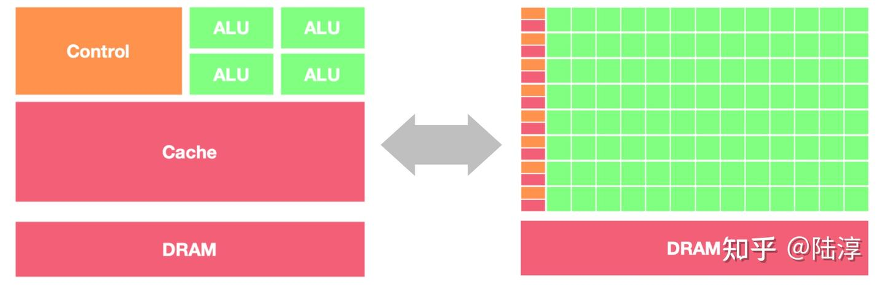
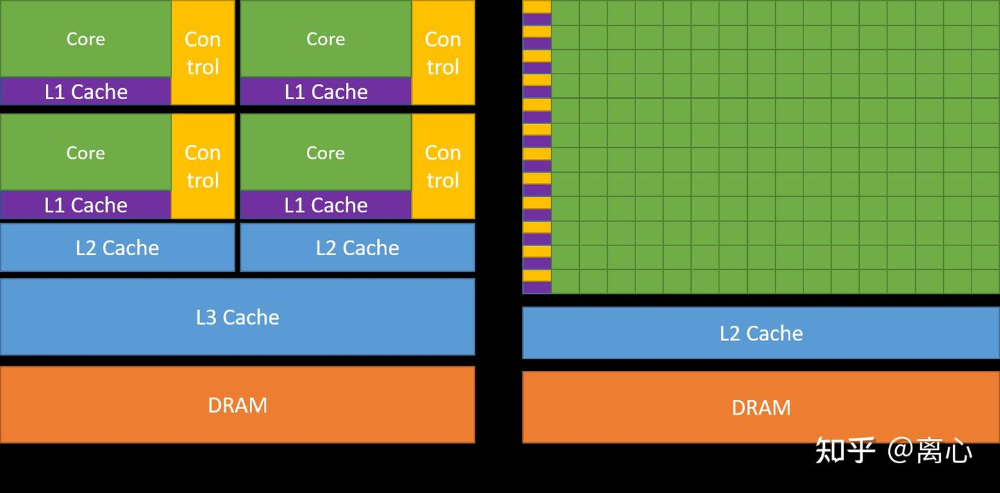
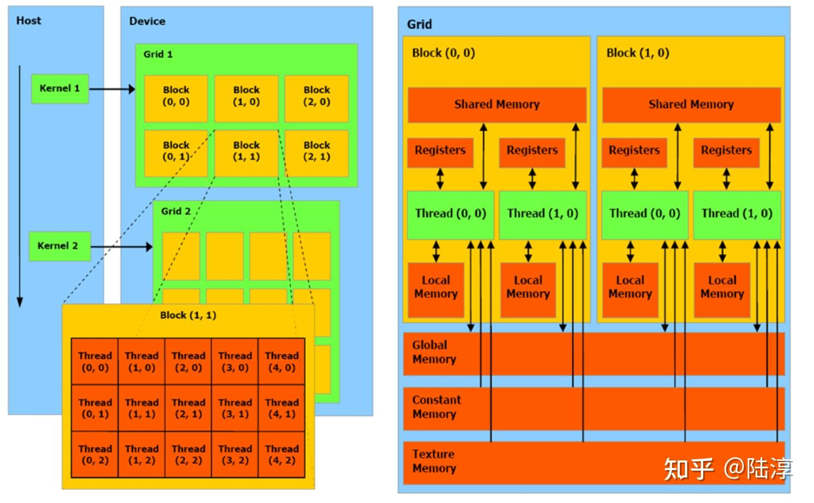
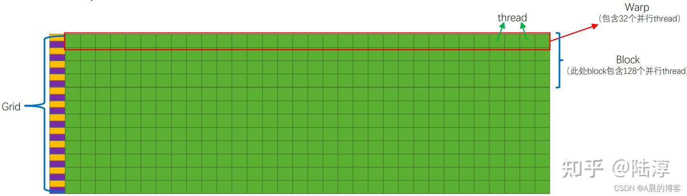
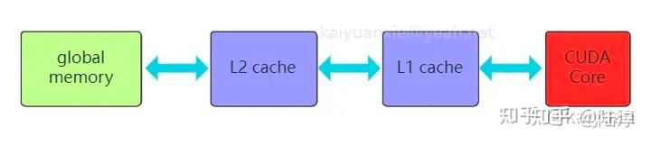
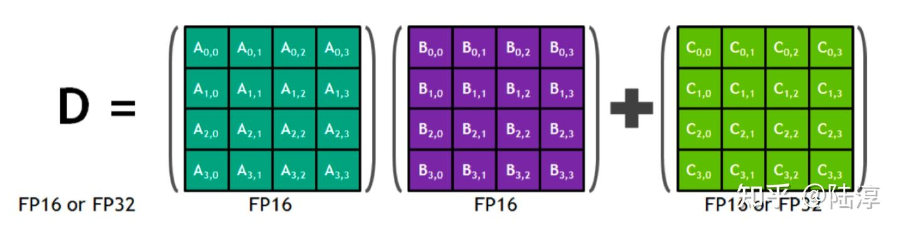
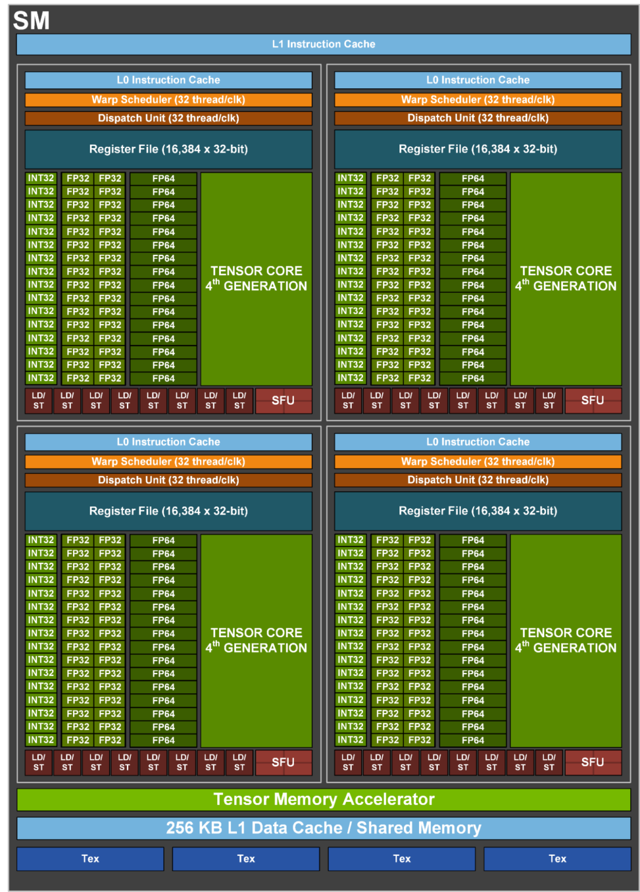

# GPU prerequisites
Nvidia GPU is based on Asynchronous SIMT(Single Instruction Multi Thread) model, you may refer to 计算机组成原理 for more info.  
It's capable of concurrently processing difference data in every thread but follows the same instruction.  
Hence it's frequently used in large matrix computing.

## brief
GPU是典型的单指令多线程机制（SIMT）
> SIMT：多个线程同时执行相同的指令序列，但是每个线程可以处理不同的数据。这些线程通常被分组成更小的线程块，每个线程块中的线程可以协调执行相同的指令。

GPU的工作原理流程如下：
1. GPU会接收来自CPU的指令,并把它们分发到多个核心中进行处理。
2. GPU会把处理后的数据传输回 CPU，以便CPU可以使用它。

GPU vs CPU: 
- GPU几乎主要由计算单元ALU组成，仅有少量的控制单元和存储单元。GPU采用了数量众多的计算单元和超长的流水线，但只有非常简单的控制逻辑并省去了Cache

- CPU 在连续计算部分，延迟优先，CPU 比 GPU 单条复杂指令延迟快10倍以上
- GPU 在并行计算部分，吞吐优先，GPU 比 CPU 单位时间内执行指令数量10倍以上。
    > 延迟：从发出指令到最终返回结果中间经历的时间间隔；吞吐量：单位时间处理的指令的条数

GPU设计目标是最大化吞吐量 (Throughout)，比单任务执行快慢，更关心并行度 (parallelism)，即同时可以执行多少任务;CPU则更关心延迟 (latency) 和并发 (concurrency)。

进一步可以具体化适合 GPU 的场景：

- 计算密集：数值计算的比例要远大于内存操作，因此内存访问的延时可以被计算掩盖。
- 数据并行：大任务可以拆解为执行相同指令的小任务，因此对复杂流程控制的需求较低。

### GPU-CPU对比图

## 内部架构
典型的GPU处理单元层次：thread < warp < block < grid

### **thread**
线程，每个thread都有自己的寄存器（registers，包括指令地址计数器PC+状态寄存器PSW等）与局部内存（local memory）。这些资源只能被自己访问，而且在不同的线程处理器之间是彼此独立的（这些资源会在线程被调度到 SM 上时分配）

### **warp**
线程束，硬件级别上的调度单位，一个 warp 包含32个并行 thread，这些 thread 以不同数据资源执行相同的指令。

### **block**
线程块，多个 threads 与 一块共享内存(Shared Memory) 即构成一块block（线程块）
- 多核处理器里边的多个线程处理器(SP)是互相并行的，不互相影响
- block 间也是并行执行，无法通信，也没有执行顺序
- block 内各 thread 间的通信可以通过 block 的共享内存进行

### **grid**
网格，多个 blocks 则会再构成grid（网格）
- kernel 在 device （稍后会提及kernel与device）上执行时，实际上是启动很多线程，一个 kernel 所启动的所有线程称为一个网格(grid)。
- 同一个 grid 上的线程共享相同的全局内存空间(Global Memory，即DRAM，人们口中的显存)
- 当一个 kernel 被执行时，网格中的线程块被分配到 SM (多核处理器) 上，一个线程块的 threads 只能在一个SM 上调度，SM 一般可以调度多个线程块，大量的 threads 可能被分到不同的 SM 上。每个 thread 拥有它自己的程序计数器和状态寄存器，并且用该线程自己的数据执行指令，这就是所谓的 Single Instruction Multiple Thread (SIMT)

### 注
- 每个 thread 都有自己的一份 register 和 local memory 的空间
- 同一个 block 中的每个 thread 则有共享的一份 share memory
- 此外，所有的 threads (包括不同 block 的 threads) 都共享一份 global memory
- 上述资源都通过 SM 的调度分配
- 不同的 grid 则有各自的 global memory。global memory即人们常说的显存

从软件的角度讲：
1. 线程处理器 (SP, Streaming Processor) 对应线程 (thread)；
2. 多核处理器 (SM, Streaming Multiprocessor) 对应线程块 (thread block)。但不是一一对应的关系，现在一个SM已经可以驻留多个线程块；
3. 设备端 (device) 对应线程块组合体 (grid)

### 上述细节如下架构图

### 更宏观的如下图

### 内存架构
GPU 内存硬件的分类，按照是否在芯片上面可以分为片上 (on chip) 内存和片下 (off chip) 内存（字面意思，片上：在芯片内；片下：在芯片外）：
1. 片上内存主要用于缓存 (cache) 以及少量特殊存储单元（如texture）。特点是速度快，存储空间小；
2. 片下内存主要用于全局存储 (global memory) 即常说的显存，特点是速度相对慢，存储空间大。不同于 CPU 系统内存可扩展的设计，GPU 的整体内存大小是固定的，在选择好显卡型号后就会确定好，包括缓存和全局存储。

总览表格：
<table>
<thead>
<tr>
<td>内存类型</td><td>可见范围</td><td>物理位置</td><td>访问速度</td><td>生命周期</td>
</tr>
</thead>
<tbody>
<tr>
<td>全局内存（global memory）</td><td>所有线程和主机端可见</td>
<td>在芯片外</td><td>慢</td><td>由主机分配和释放</td>
</tr>
<tr>
<td>局部内存（local memory）</td><td>单个线程可见</td>
<td>在芯片外</td><td>慢</td><td>所在线程</td>
</tr>
<tr>
<td>共享内存（shared memory）</td><td>线程块内可见</td>
<td>在芯片内</td><td>中</td><td>所在线程块</td>
</tr>
<tr>
<td>常量内存（constant memory）</td><td>所有线程和主机端可见</td>
<td>在芯片外</td><td>中</td><td>由主机分配和释放</td>
</tr>
<tr>
<td>纹理内存（texture memory）</td><td>所有线程和主机端可见</td>
<td>在芯片外</td><td>中</td><td>由主机分配和释放</td>
</tr>
<tr>
<td>寄存器内存（register）</td><td>单个线程可见</td>
<td>在芯片内</td><td>快</td><td>所在线程</td>
</tr>
</tbody>
</table>

### 片上内存
1. **L1/L2缓存**  
L2 缓存可以被所有 SM 访问，速度比全局内存快；L1 缓存用于存储 SM 内的数据，被 SM 内的 CUDA cores（稍后会提及） 共享，但是跨 SM 之间的 L1 不能相互访问。  
合理运用 L2 缓存能够提速运算。A100 的 L2 缓存能够设置至多 40MB 的持续化数据 (persistent data)，能够拉升算子 kernel 的带宽和性能。Flash attention 的思路就是尽可能地利用 L2 缓存，减少 HBM（high bandwidth memory,也被称为显存）的数据读写时间。

2. **寄存器**  
寄存器（register）是线程能独立访问的资源，它是片上（on chip）存储，用来存储一些线程的暂存数据。寄存器的速度是访问中最快的，但是它的容量较小，只有几百甚至几十 KB，而且要被许多线程均分。

3. **共享内存**  
共享内存（shared memory）是一种在线程块内能访问的内存，是片上（on chip）存储，访问速度较快。

共享内存主要是缓存一些需要反复读写的数据。

注：共享内存与 L1 缓存的位置、速度极其类似，区别在于共享内存的控制与生命周期管理与 L1 不同：共享内存受用户控制，L1 受系统控制。共享内存更利于线程块之间数据交互。

### 片下内存
1. **全局内存**  
全局内存（global memory）能被 GPU 的所有线程访问，全局共享。它是片下（off chip）内存，前面提到的硬件 HBM 中的大部分都是用作全局内存。跟 CPU 架构一样，运算单元不能直接使用全局内存的数据，需要经过缓存，其过程如下图所示：

2. **局部内存**  
局部内存 (local memory) 是线程独享的内存资源，线程之间不可以相互访问。局部内存属于片下内存，所以访问速度跟全局内存一样。它主要是用来应对寄存器不足时的场景，即在线程申请的变量超过可用的寄存器大小时，nvcc 会自动将一部数据放置到片下内存里。

3. **常量内存**  
常量内存（constant memory）是片下（off chip）存储，但是通过特殊的常量内存缓存（constant cache）进行缓存读取，它是只读内存。  
常量内存主要是解决一个 warp scheduler 内多个线程访问*相同数据*时速度太慢的问题。假设所有线程都需要访问一个 constant_A 的常量，在存储介质上 constant_A 的数据只保存了一份，而内存的物理读取方式决定了多个线程不能在同一时刻读取到该变量，所以会出现先后访问的问题，这样使得并行计算的线程出现了*运算时差*。常量内存正是解决这样的问题而设置的，它有对应的 cache 位置产生多个副本，让线程访问时不存在冲突，从而保证并行度。

### 流处理器：SM与SP  
- SP: streaming processor; SM: streaming multiprcessor  
SP 是单线程的基本处理器；SM 是总的资源调度处理器  
从 G80 提出的概念，SM 中文称流式多处理器，核心组件包括CUDA核心、共享内存、寄存器等。SM包含许多为线程执行数学运算的Core，是 NVIDA 的核心。  
在CUDA中，可以并发地执行数百个线程。一个 block 上的线程是放在同一个 SM，一个 SM 的有限 Cache 制约了每个 block 的线程数量。

SM 主要包括:
- CUDA Core: 向量运行单元 (FP32-FPU、FP64-DPU、INT32-ALU);最开始叫SP(Streaming Processor)， 是GPU最基本的处理单元，在 fermi 架构开始被叫做CUDA core。Volta 架构时期取消了CUDA Core，变成了单独的FPU 和 ALU；
- Tensor Core: 张量运算单元(FP16、BF16、INT8、INT4)；
- Special Function Units: 特殊函数单元 SFU(超越函数和数学函数，e.g. 反平方根、正余弦等)；
- Warp Scheduler: 线程束调度器(XX Thread / clock)；
- Dispatch Unit: 指令分发单元(XX Thread / clock)；
- Multi level Cache: 多级缓存(L0/L1 Instruction Cache、L1 Data Cache & Shared Memory)；
- Register File: 寄存器堆；
- Load/Store: 访问存储单元LD/ST(负责数据处理)

> 其中 Tensor Core 是从 Volta 架构推出来的、混合精度（使用半精度(FP16)作为输入和输出，使用全精度(FP32)进行中间结果计算）的、将累加和累乘放在一起的计算硬件。所以 GPU 上有 Tensor Core 是使用混合精度训练加速的必要条件  
> 混合精度：

例：在 NVIDIA H100（Hopper架构）上：
- 一个 block 最多处理 1024个线程
- 每个SM最多可以处理32个 block ；或64个 warp
- 每个SM有65536个寄存器。要同时执行2048个线程，每个线程最多可以有32个寄存器（65536/2048 = 32）
- 第四代Tensor Core：H100的TensorCore计算能力相较于A100提升6倍，这里包括2x的MMA计算效率提升（以FP8来算的话就是4x的算力提升），更多的SM数量（132 vs 108 1.22x）和更高的SM频率（1.3x）
- DPX指令：7x的动态规划算法效率提升
- 3倍的FP64和FP32算力提升：包括单SM 2x的Cuda Core数量提升，以及SM数量和频率的提升
- Thread Block Cluster：一个新的任务切分纬度，Grid->TBC->Block->Thread，使得一个GPC中的多个SM之间可以协作同步，完成更大颗粒度的计算
- 分布式Shared Memory：得益于GPC中SM to SM交换网络，允许SM和SM之间进行load/store/atomic等操作，变相提升了共享内存的大小和利用率
- TMA：Tensor Memory Accelerator提供了一种异步数据传输机制，在Ampere的基础上，使能了更高效的地址计算和数据块搬移。同时，也提供了一种异步传输栅栏来同步原子数据移动
- Shared memory ＆ L1：256KB（Shared Mem Max Configure 228KB），是A100（192KB）的1.33倍

NVIDIA H100 SM图例：
